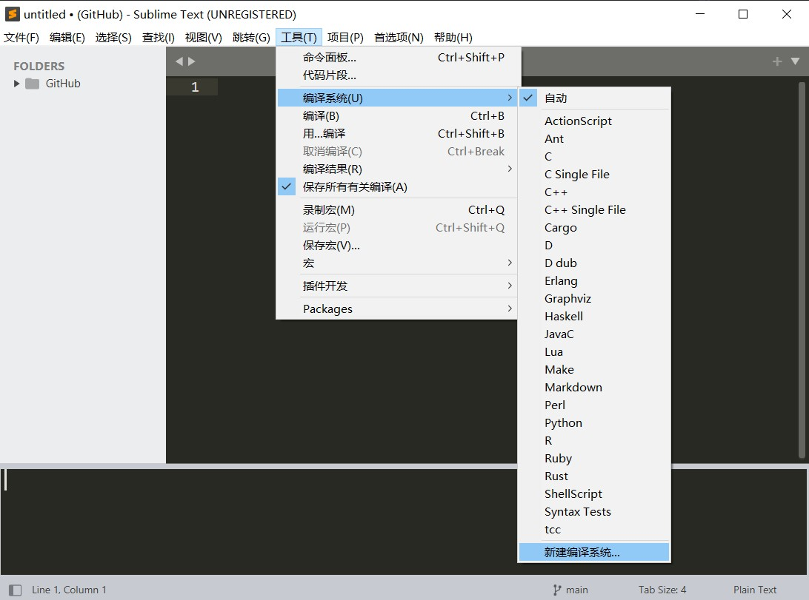

## Sublime Text3的配置
首先下载MinGW的C语言内核，这里提供一种[MinGW](https://sourceforge.net/projects/mingw/)下载地址。下载完成后按照提示安装，配置环境变量，重启。
进入Sublime Text，Tools(工具)-->编译系统-->新建编译系统。如图所示。

输入如下代码(C.sublime-build)。
```json
// windows环境
{

	"working_dir": "$file_path",
	
	"cmd": "gcc -Wall \"$file_name\" -o \"$file_base_name\"",
	
	"file_regex": "^(..[^:]*):([0-9]+):?([0-9]+)?:? (.*)$",
	
	"selector": "source.c",
	
	"variants":
	
	[
	
	{
	
	     "name": "Run",
	
	     "shell_cmd": "gcc -Wall \"$file\" -o \"$file_base_name\" && start cmd /c \"${file_path}/${file_base_name} & pause\""
	
	}
	
	]

}

```

C++配置如下(C++.sublime-build)。
```json
// windows系统
{
	"cmd": ["g++", "${file}", "-o", "${file_path}/${file_base_name}"],
	"file_regex": "^(..[^:]*):([0-9]+):?([0-9]+)?:? (.*)$",
	"working_dir": "${file_path}",
	"selector": "source.c, source.c++",

	"variants":
	[
		{
			"name": "Run",
			"cmd": ["cmd", "/c", "g++", "${file}", "-o", "${file_path}/${file_base_name}", "&&", "cmd", "/c", "${file_path}/${file_base_name}"]
		},
		{
			"name": "RunInCommand",
			"cmd": ["cmd", "/c", "g++", "${file}", "-o", "${file_path}/${file_base_name}", "&&", "start", "cmd", "/c", "${file_path}/${file_base_name} & pause"]
		}
	]
}
```
现在C/C++已经可以运行了。