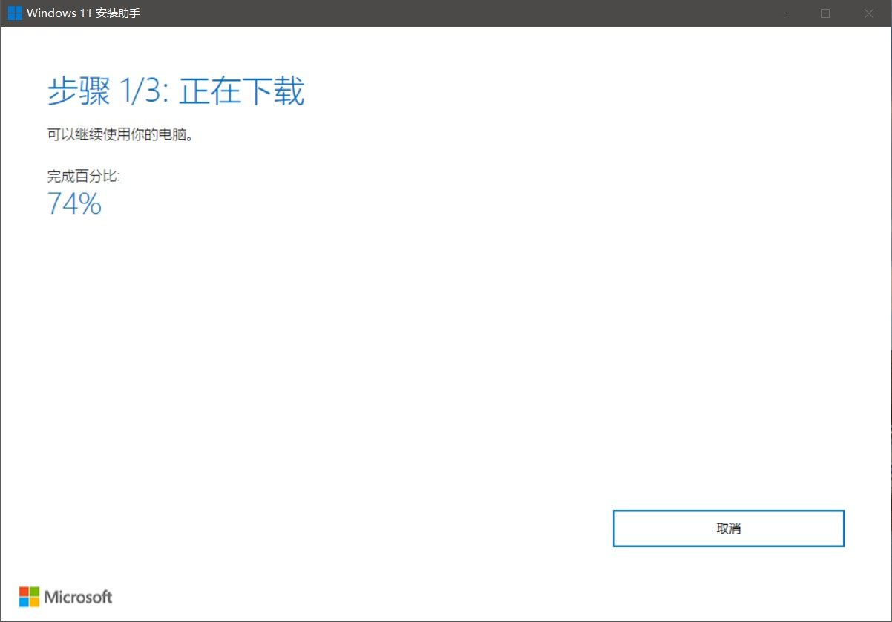
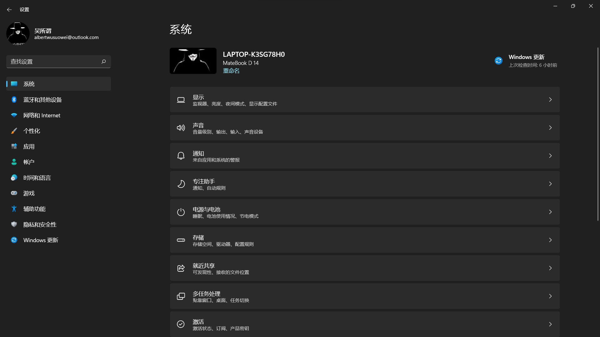

# Windows11测评
上一周更新了Windows11,用了一周,是用官方的Windows11安装助手安装的.  
其实吧,总体来说,变化不大......不是我开玩笑,是真的不大.

除了UI界面大改(疑似抄袭...)之外,别的像内核,程序都没改,所以理论上来说能在Windows10上运行的程序都能在Windows11上运行.  

很多人在问Bug多吗? 没有明显的bug但小bug还是有的,就比如我的设置的个性化就打不开,一点就卡退.  
建议升级吗?  如果没啥太大必要,不升也可以.