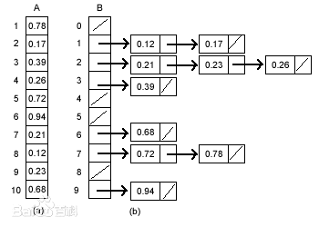

## 1.桶排序算法
排序是所有算法中最基础的算法。桶排序是较为简单的一种。

桶排序的主要思想就是，
```
先设置好N个桶，将输入进的数依次加入到桶，最后将桶内的数从小到大输出,桶中的数出现几次就输出几次。
```
我们举一个例子。  
要求输入一串数字，输出这串小于1000的数字的倒序。  
例如，输入 1 3 5 2 4 6,输出 6 5 4 3 2 1。

完整代码如下。
```c
#include <stdio.h>
#include <stdlib.h>

int main()
{
	int book[1001],bucklet,n;

	for (int i = 1; i <= 1000; i++)
		book[i] = 0; //数组初始化为0

	scanf("%d",&n); //读取n个数

	for (int i = 1; i <= n; i++)
	{
		scanf("%d",&bucklet); //读取数
		book[bucklet]++; //添加进桶
	}

	//核心部分，用于打印所有添加进桶里的部分/
	for (int i = 1000; i >= 0; --i)
		for (int j = 1; j <= book[i]; ++j)
			printf("%d ", i);

	return 0;
}
```
我们已经成功实现了这个功能。  
最后讲一下时间复杂度，这里的时间复杂度就是循环执行了N(for i循环)次，加上循环了M次(for j循环)所以时间复杂度为$O(N+M)$。  
这是一个很快很简单的算法，但它只是对数字进行排序，没有对其本身排序，接下来会讲的的冒泡排序就弥补了这一缺陷。


## 冒泡排序算法
上一张我们讲了桶排序这一种快速简单的排序算法，但还是有一个缺点，就是浪费空间。假设这里有3个数 1，500，1324234 这时我们必须要设置1324235个变量而只用到三个，十分浪费空间。  
现在，我们这里有一道题。  
```
有n个学生(n<30),要求按照分数从大到小排序输出。
例如:输入-> 90 小明 86 小华 67 虎虎 100 小张
    输出-> 100 小张 90 小明 86 小华 67 虎虎
```
这里我们就无法使用桶排序了。我们就需要讲到一个新算法**冒泡排序**,冒泡排序算法思路很简单。
```
依次计较相邻的两个数，如果没有按照顺序排列就交换，直到无法比较为止。
```
完整代码实现如下。
```c
#include <stdio.h>
#include <stdlib.h>

struct student
{
	/* 此结构体用于储存姓名和分数 */
	char name[30];
	int score;
};

int main()
{

	struct student a[100],t;
	int n;

	scanf("%d",&n);

	for (int i = 1; i <= n; ++i)
		scanf("%s %d",&a[i].name,&a[i].score);

	//按分数高低进行排序
	for (int i = 1; i <= n-1 ; ++i)
		for (int j = 1; j <= n-1; ++j)
			if (a[j].score<a[j+1].score)
				{
          // 顺序不对，交换它们
					t = a[j];
					a[j] = a[j+1];
					a[j+1] = t;
				}

	for (int i = 1; i <= n; ++i) //输出人名
		printf("%s\n", a[i].name);

	return 0;
}
```  

现在我们已经可以实现题目要求了。
这个算法就像气泡在水里一样向上冒所以叫做冒泡排序，举一个图的例子。
  
这个算法可以直观的看到这个算法并不是很快，确实，依次比较非常耗时间，这个算法的时间复杂度为 $O(N^2)$。之后又有很多人尝试去改进该算法,**快速排序**就是一种.  


## 快速排序算法
快速排序算法是对冒泡排序的一种改进.它的基本思想是(分治):通过一趟排序将待排序记录分割成两个独立的部分,其中一部分记录的关键字均比另一部分的关键字笑,则可分别对这两部分记录继续进行排序,以达到整个序列有序.  

这其实是一个递归的过程(自己调用自己),一趟快速排序的实现如下:设置两个指针i,j,它们的初始值为左边最小的,右边最大的,设置中间的分割线为mid,i依次加大到mid,j依次减小到mid,依次交换a[i]的数和a[j]的数,一直递归这两步,直到i>j为止.  
例:6个数字[1,3,2,5,4,6],快速排序如下:  
[1,3,2,5,4,6]  
第一次:[<u>6</u>,3,2,5,4,<u>1</u>]  //目前所有顺序都对  
第二次:[<u>2</u>,3,<u>6</u>],[<u>1</u>,4,<u>5</u>] //分开  
第三次:[2,3,6,1,4,5]  
第三次:[2,3,<u>1</u>,<u>6</u>,4,5]  
第四次:[<u>1</u>,3,<u>2</u>],[<u>5</u>,4,<u>6</u>]  
第五次:[1,2,3,4,5,6] //基准数归位

快速排序实现如下(程序的良好阅读方法是从主程序开始阅读):
```cpp
#include <iostream>
using namespace std;
int n, a[1001];

void quicksort(int l, int r){
    int i = 1, j = r, mid;
    mid=a[(l + r) / 2];             //序列中间
    do{
        while (a[i] < mid) ++i;   //左半部分,从左往右加
        while (a[j] > mid) --j;   //右半部分,从右往左减
        if (i <= j) {
            swap(a[i], a[j]);    //顺序不正确就交换它们
            ++i, --j;           //继续下一步
        }
    }while(i <= j);
    if (l < j) quicksort(l, j);    //未到两数边界就递归寻找下一个
    if (i < r) quicksort(i, r);
}

int main(){
    cin>>n;

    for(int i=1;i<=n;i++)
        cin>>a[i];

    quicksort(1,n);             // 快速排序

    for(int i=1;i<=n;i++)
        cout<<a[i]<<" ";

    return 0;
}
```


## 插入排序算法
插入排序的思想如下:当读入某一个数时,在已经排好的序列里搜索它的正确位置,再放入该元素.
还有一个重要的问题,在插入此元素之前,应当先将它后面的所有元素向后移动一位,以保证插入位置的原先元素不会被覆盖.  
假设:输入n=6,数组a中的6个元素为[36 24 50 4 20 15],执行插入排序.  
插入排序算法如下:  
第0步:[<u>36</u>] 24 50 4 20 15  
第1步:[<u>24</u> 36] 50 4 20 15  
第2步:[24 36 <u>50</u>] 4 20 15  
第3步:[<u>4</u> 24 36 50] 20 15  
第4步:[4 <u>20</u> 24 36 50] 15  
第5步:[4 <u>15</u> 20 24 36 50]  
C++程序实现如下:
```cpp
#include <iostream>
using namespace std;

int main(){
	int n, a[1001], book[1000];
	float temp;
	cin>>n;
	for(int i=1;i<=n;++i)
	    cin>>a[i];

	for(int i=1;i<=n;++i){
		for(int j=i-1;j>=1;--j)
			if(a[j]<a[i])
                break;
		if(j!=i-1){
			temp = a[i];
			for(int k=i-1;k>j;k--)
			    a[k+1] = a[k];
			a[k+1]=temp;
		}
	}

	for(int i=1;i<=n;++i)
	    cout<<a[i]<<" ";

	return 0;
}

```


## 选择排序
选择排序的思想是:第一次从待排序的数据元素中选出最小（或最大）的一个元素，存放在序列的起始位置，然后再从剩余的未排序元素中寻找到最小（大）元素，然后放到已排序的序列的末尾。以此类推，直到全部待排序的数据元素的个数为零。选择排序是不稳定的排序方法，时间复杂度为$O(N^2)$。
C++程序实现如下:
```cpp
#include<iostream>
using namespace std;
int n,a[1001];

int main(){
	cin >> n;  						
	for(int i = 0; i < n ; ++i)
		cin >> a[i];

	for(int i = 0; i < n - 1 ;++i){		
    // 将第i小的元素放好
		int minn = i;  // 数组中的最小值
		for(int j = i; j < n ;++j){
			if(a[j] < a[minn])
				minn = j;
		}
    swap(a[i],a[minn])  //交换位置
	}

	for(int i = 0; i < n ; ++i)
		cout << a[i] << endl;
	return 0;
}
```


## 归并排序
归并排序的思想也是采用分治算法,将两个已有序的子序列合并，合成一个完全有序的序列。
```cpp
#include <iostream>
using namespace std;
int n, a[1001], r[1001];
void msort(int s, int t)
{
	if (s == t)
		return ;

	int mid = (s + t) / 2;
	msort(s, mid);
	msort(mid + 1, t);
	int i = s, j = mid + 1, k = s;

	while (i <= mid && j <= t) {
		if (a[i] <= a[j]) {
			r[k] = a[i];
			k++, i++;
		} else {
			r[k] = a[j];
			k++, j++;
		}
	}

	while (i <= mid) {
		r[k] = a[i];
		k++, i++;
	}

	while (j <= t) {
		r[k] = a[j];
		k++, j++;
	}

	for (int i = s; i <= t ; ++i) {
		a[i] = r[i];
	}
}

int main()
{
	cin.tie(0);
	cin >> n;

	for (int i = 1; i <= n ; ++i) {
		cin >> a[i];
	}

	msort(1, n);

	for (int i = 1; i <= n ; ++i) {
		cout << a[i] << " ";
	}

	return 0;
}


```
