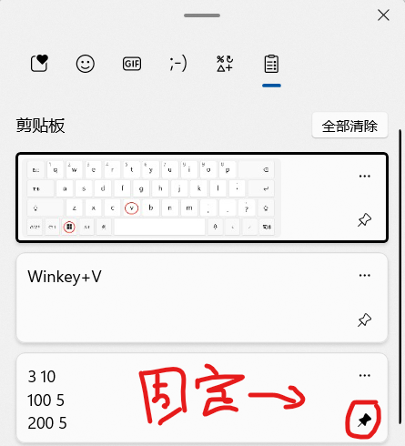

# Windows11上的新功能
众所周知，Minecraft近期退出了Windows11。[官方](https://www.microsoft.com/zh-cn/windows?r=1)宣传的是一个全新的系统。  
某些方面来说确实全新，比如界面，以及速度(变慢了...)。不少用户也选择了更新Windows11(免费更新，可以看我以前的[文章](https://albert-wuchenyu.github.io/Windows11%E6%B5%8B%E8%AF%84.html))，有些用户觉得界面不习惯，不会用。其实没必要担心，只是UI界面大幅度更改，操作方式和内核都没变，一些原有功能都保存了。  
下面就详细地介绍一些Windows11推出的新功能，视觉效果。

## 1.圆角！
Windows11的工程师终于会用圆角了，这是个人的一小步确实Windows用户的一大步。之前饱受嫌弃的正方形界面被省去了，随着系统更新逐渐圆润所有界面。

(不圆润的地方要打马赛克)  
总结:养眼，但不是很实用，且没有完全圆润。

## 2.剪贴板功能！
这是Windows11的新增功能，可以记录复制的数据，方便要复制的时候找不到以前的内容，但是**每次重启都会清空**。
启动方式: Winkey+V

(固定的话可以保证下次重启也不会清除)
